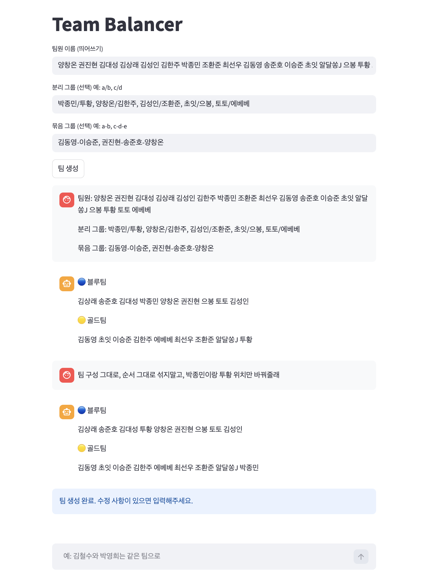
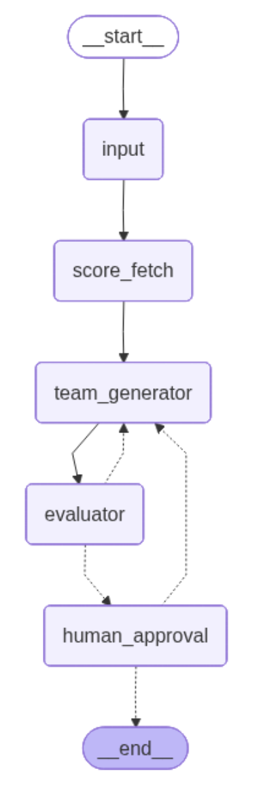

# Team Balancer AI

## 실행 방법
```bash
PYTHONPATH=. uv run streamlit run app/main.py
```

> **LangGraph 기반 Human-in-the-loop AI Workflow로 풋살 팀 밸런싱 과정을 자동화한 실사용 프로젝트**

<p align="center">
  기존 15분 이상 걸리던 팀 구성 작업을 <b>3분 이내</b>로 단축하고,  
  단순 랜덤이 아닌 <b>상태 기반 AI Workflow</b>를 통해 실제 운영 가능한 팀 생성 시스템을 구현했습니다.
</p>

---

## Preview

### Main UI
> 실제 Streamlit 기반 팀 생성 UI



### LangGraph Workflow
> 상태(State) 기반 AI Workflow 구조



---

## 프로젝트 소개

풋살 운영 과정에서는 매 경기마다 아래와 같은 반복 작업이 발생했습니다.

- 팀원 점수 입력 반복
- 밸런스 조정 반복
- 특정 조합 요청 반영
- 외부 서비스와 LLM을 오가는 비효율
- 수정사항 발생 시 전체 재구성 필요

기존 랜덤 기반 방식은 재미는 있지만 밸런스가 무너졌고,  
완전 고정 조합은 공정성과 다양성이 떨어졌습니다.

이를 해결하기 위해:

- **LangGraph 기반 상태(State) 중심 Workflow**
- **Human-in-the-loop 승인 구조**
- **LLM 기반 팀 생성 + 평가 루프**
- **must_link / cannot_link 조건 처리**

를 결합한 실사용 AI Workflow 시스템을 설계 및 구현했습니다.

---

## 핵심 성과

| 항목 | 결과 |
|---|---|
| 팀 생성 시간 | 15분 → 3분 이내 |
| 사용 환경 | 실제 18명 풋살 운영 |
| 사용 빈도 | 주 2회 지속 사용 |
| 핵심 구조 | LangGraph 기반 상태 관리 |
| Workflow | Generate → Evaluate → Human Approval |
| 사용자 피드백 반영 | 묶음 그룹 / 분리 그룹 기능 추가 |

---

## 주요 기능

### AI 기반 팀 생성
- LLM 기반 팀 조합 생성
- 랜덤성과 밸런스를 동시에 고려

### 상태 기반 Workflow
- LangGraph 기반 상태 흐름 관리
- 재생성 및 승인 프로세스 관리

### Human-in-the-loop 승인 구조
- 생성 결과 확인 후:
  - 승인
  - 피드백 기반 재생성
- 실제 운영 환경에 맞는 현실적인 AI 시스템 설계

### 팀 밸런스 평가
- score diff 기반 평가 로직 적용
- 극단적인 팀 점수 차이 방지

### 조건 기반 팀 구성
- `must_link`
  - 반드시 같은 팀
- `cannot_link`
  - 반드시 다른 팀

### JSON 기반 점수 관리
- 간단한 수정 및 운영 가능
- DB 없이 빠른 관리 가능

---

## 기술 스택

| Category | Tech |
|---|---|
| Language | Python 3.11+ |
| AI Workflow | LangGraph |
| LLM | GPT-5-nano, Gemini-2.5-flash-lite |
| Validation | Pydantic |
| State Management | TypedDict |
| UI | Streamlit |
| Data Storage | JSON |
| Environment | dotenv |

---

## 시스템 아키텍처

```text
Input
  ↓
Score Fetch
  ↓
Team Generator (LLM)
  ↓
Evaluator
  ↓
Human Approval
   ├─ 승인 → 종료
   └─ 피드백 → 재생성 루프
```

---

## 핵심 구현 내용

### 1. LangGraph 기반 상태(State) 중심 Workflow 설계

단순 Prompt Chaining 방식이 아니라:

- 생성 결과 유지
- 피드백 누적
- 승인 상태 관리
- 재생성 흐름 유지

가 가능한 구조가 필요했습니다.

이를 위해:
- `TypedDict`
- `Pydantic`
- `LangGraph`

를 결합해 상태 중심 Workflow를 설계했습니다.

---

### 2. Human-in-the-loop 구조 설계

완전 자동화만으로는 실제 운영 요구사항을 모두 반영하기 어려웠습니다.

예를 들어:
- 특정 조합 요청
- 운영 경험 기반 수정
- 즉석 피드백 반영

등이 필요했기 때문에:

```text
생성 → 평가 → 사용자 승인 → 재생성
```

루프를 설계하여 현실적인 AI 시스템 구조를 구현했습니다.

---

### 3. LLM + 평가 로직 결합

완전 랜덤 생성은 밸런스가 무너졌고,  
완전 최적화는 재미 요소가 감소했습니다.

따라서:
- LLM 기반 조합 생성
- score diff 평가
- 임계치 기반 재생성

방식을 결합해:

- 랜덤성
- 공정성
- 실사용성

사이의 균형을 맞췄습니다.

---

## 기술적 의사결정

### 왜 LangGraph를 선택했는가?

이 프로젝트는 단순한 챗봇이 아니라:

- 상태 유지
- 조건 분기
- 승인 흐름
- 재생성 루프

가 핵심인 Workflow 시스템이었습니다.

LangGraph는:
- 상태 기반 흐름 제어
- 노드 단위 책임 분리
- Human Approval 구조 표현

에 적합하다고 판단했습니다.

---

### 왜 알고리즘 대신 LLM 생성 방식을 사용했는가?

실제 운영에서는:

> "완벽한 최적화"보다  
> "사람이 공정하다고 느끼는 랜덤성"

이 더 중요했습니다.

또한:
- must_link
- cannot_link
- 사용자 피드백

같은 자연어 수준 요구사항 처리에 유리했습니다.

---

### 왜 JSON 기반 저장 구조를 선택했는가?

현재 운영 규모에서는:
- 빠른 수정
- 관리 편의성
- 단순성

이 더 중요했습니다.

따라서 DB 대신 JSON 기반 구조를 사용하여 운영 비용을 최소화했습니다.

---

## 트러블 슈팅

### 1. 상태 없는 LLM Workflow 문제

#### 문제
기존 Prompt 기반 방식에서는:
- 이전 결과 유지 불가
- 피드백 누적 불가
- 재생성 흐름 관리 불가

#### 해결
- LangGraph 도입
- TypedDict 기반 상태 구조 설계

#### 결과
Workflow 전체를 상태 기반으로 관리 가능해졌습니다.

---

### 2. 완전 랜덤 생성 시 팀 밸런스 붕괴

#### 문제
랜덤 셔플 시 점수 차이가 과도하게 발생

#### 해결
LLM 생성 후:
- score diff 계산
- 평가 단계 추가

#### 결과
랜덤성을 유지하면서도 균형 잡힌 팀 생성 가능

---

### 3. 실제 운영 요구사항 반영 어려움

#### 문제
AI 자동화만으로는:
- 특정 조합 요구
- 운영 경험 기반 수정

반영이 어려웠음

#### 해결
Human Approval + 재생성 구조 도입

#### 결과
현실적인 운영 가능한 AI Workflow 구축

---

## 성능 개선 및 운영 개선 경험

| Before | After |
|---|---|
| 팀 구성 15분 이상 | 3분 이내 |
| 수동 점수 계산 | 자동 평가 |
| 수정사항 발생 시 전체 재구성 | 재생성 루프 기반 수정 |
| 랜덤 기반 밸런스 붕괴 | 평가 기반 균형 조정 |

---

## 사용자 피드백 반영 경험

실제 사용 과정에서:

- 특정 인원 묶기
- 특정 인원 분리

요구사항이 반복적으로 발생했습니다.

이를 반영하여:
- `must_link`
- `cannot_link`

기능을 추가했고,  
실제 운영 효율과 만족도를 개선했습니다.

---

## 디렉토리 구조

```text
team-balancer/
├── data/
├── app/
│   ├── exceptions/
│   ├── graph/
│   ├── llm/
│   ├── schemas/
│   ├── utils/
│   └── main.py
├── .env
├── requirements.txt
└── README.md
```

---

## 실행 방법

### 1. Repository Clone

```bash
git clone https://github.com/your-id/team-balancer.git
cd team-balancer
```

### 2. 패키지 설치

```bash
pip install -r requirements.txt
```

### 3. 환경 변수 설정

`.env`

```env
OPENAI_API_KEY=your_key
GEMINI_API_KEY=your_key
```

### 4. 실행

```bash
PYTHONPATH=. uv run streamlit run app/main.py
```

---

## 배포 (Streamlit Community Cloud)

Streamlit 공식 무료 호스팅을 사용합니다. (Vercel은 서버리스 구조라 Streamlit과 호환되지 않습니다.)

### 1. 앱 생성

[share.streamlit.io](https://share.streamlit.io) → **New app** → 레포/브랜치 선택

- **Main file path**: `app/main.py`
- **Python version**: 3.11 이상

### 2. Secrets 설정

앱 생성 후 **Settings → Secrets**에 아래 입력:

```toml
GOOGLE_API_KEY = "..."
ZAI_API_KEY = "..."
APP_PASSWORD = "공유할 비밀번호"
```

> `APP_PASSWORD`는 로그인 게이트용 공유 비밀번호입니다. 접근을 허용할 사람에게만 알려주세요.

> GLM 톡이 끊기면 `USE_GEMINI = "1"` 한 줄을 Secrets에 추가하면 Gemini(`GOOGLE_API_KEY`)로 전환됩니다.

### 3. 점수 갱신

`data/scores.json`은 읽기 전용으로 배포됩니다. 점수를 바꾸려면 로컬에서 수정 → `git push` → 자동 재배포됩니다.

---

## 프로젝트 미리보기 추천 구성

```text
assets/
├── main-ui.png
├── workflow-graph.png
├── team-result.png
└── approval-flow.png
```

---

## 배운 점 및 회고

이 프로젝트를 통해 단순히 LLM API를 호출하는 수준이 아니라:

- 상태 기반 AI Workflow 설계
- Human-in-the-loop 구조 설계
- 실사용 중심 UX 설계
- LLM 생성 결과 평가 구조
- Workflow 재생성 루프 설계

를 직접 경험할 수 있었습니다.

특히:

> "AI 시스템은 단순 생성보다  
> 사용자의 운영 흐름 안에서 어떻게 동작하는가가 중요하다"

는 점을 깊게 배울 수 있었고,

실제 사용자의 반복 피드백을 기반으로  
AI Workflow를 개선하는 경험을 할 수 있었습니다.

---

## Future Improvements

- 팀 생성 품질 자동 평가 고도화
- Prompt 전략 개선
- 사용자별 플레이 스타일 반영
- 팀 밸런스 시각화
- DB 기반 데이터 관리
- 배포 환경 구축
- 경기 결과 기반 점수 자동 업데이트

---

## Repository

[team-balancer](https://github.com/your-id/team-balancer)